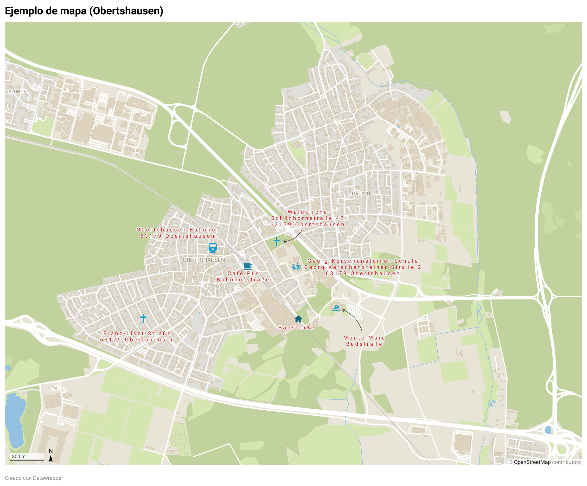

Recordemos los pasos para construir nuestra web:

- vamos a crearla desde `nano`.
- utilizaremos _Markdown_ para la sintexis
- después convertiremos el _Markdown_ a HTML con la [página de prueba de Pandoc](https://pandoc.org/try)
- Por último subiremos nuestros avances a Github y alojaremos allí nuestra web.

-----------------------------------------------------

## Insertamos aquí nuestro iframe

Lorem ipsum dolor sit amet, consectetur adipiscing elit. Mauris dapibus venenatis eleifend. Nulla eget interdum augue. Donec cursus vitae dui sit amet viverra. Proin at vulputate diam. Ut porta turpis at efficitur facilisis. Vestibulum ac purus commodo, fringilla magna ut, dignissim nulla. Mauris convallis imperdiet purus, scelerisque fringilla velit. Duis scelerisque, massa fermentum mollis imperdiet, libero orci aliquam odio, vitae luctus mi ex vel neque. Vivamus consectetur sed nunc id rutrum. Ut in turpis mollis, pellentesque neque at, varius lorem. Quisque sagittis quam sit amet urna vestibulum vestibulum vitae at urna. Vestibulum a molestie neque, eu porttitor massa. Aliquam vitae justo urna. Nunc sit amet risus quam. Mauris vel facilisis nunc, et condimentum velit. Sed euismod arcu laoreet, ullamcorper enim vel, lobortis augue. 
----------------------------------------------------

## Insertamos aquí una imagen

Suspendisse tristique maximus ex nec semper. Etiam scelerisque rhoncus lacus in elementum. Pellentesque finibus venenatis lacus, non faucibus neque euismod ut. Integer sed venenatis sem, et faucibus dolor. Aliquam sollicitudin aliquet quam at sagittis. Sed consequat, sem id eleifend volutpat, lectus ex malesuada leo, ut facilisis nunc massa non nulla. Nam ante dui, fermentum id mollis ac, pretium nec arcu. Proin feugiat et massa sit amet cursus. Sed hendrerit, dui eget ullamcorper ultrices, turpis urna placerat leo, non lacinia tortor enim ut nibh. Aenean facilisis urna vitae risus porttitor egestas. Sed non arcu vel arcu ultricies tristique. 

